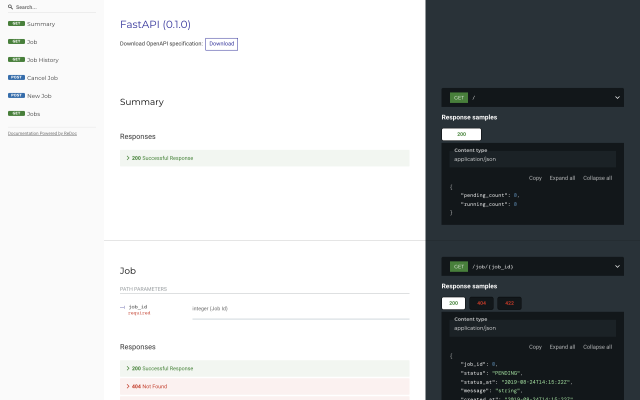

[](https://monetary-metals.com/)

# Take-Home Coding Exercise

Howdy, and thanks for your interest in Monetary Metals!
We would like you to tackle a take-home exercise as your first interview.

To help you get started, we've added you as a contributor to this private repository.
It's helpful to us if you avoid sharing this with others.
The exercise is intended to be to be completed solely by you.

## The Problem

This repository contains a sandbox API server that provides a simple jobs processing API.
The API allows callers to kick off new jobs, get statuses, histories, and even cancel pending jobs.

Sadly, we have no UI.
That's where you come in!

## Overview

We'd like you to build and demo a simple UI on top of our API.
While you are welcome to take whatever approach you like, we recommend the following:

1. Clone this repository.
2. Get our sandbox API server up and running.
3. Craft a web front-end demo using whatever references, tools, frameworks, best practices, etc. are familiar to you.
4. Replace (or augment) this ``README.md`` with instructions how to run your demo.
5. Create a PR with your changes for us to review.

## Setup

You will need to have access to [Bash](https://www.gnu.org/software/bash/) and a reasonably recent version of [Python](https://www.python.org/).
Setting those up is beyond the scope of this document.
With those, you should be able to get and start the sandbox API server as follows:

``` sh
$ # Clone the repo
$ git clone https://github.com/…/….git mm-takehome
…
$ cd mm-takehome

$ # If you already have Tox installed, you can do this
$ tox -e run
…
run run-test: commands[0] | uvicorn mm:app
INFO:     Started server process [35494]
INFO:     Waiting for application startup.
INFO:     Application startup complete.
INFO:     Uvicorn running on http://127.0.0.1:8000 (Press CTRL+C to quit)
```

If you don't already have [Tox installed](https://tox.readthedocs.io/en/latest/install.html), or if you don't have a preferred method for creating [Python virtual environments](https://docs.python.org/3/tutorial/venv.html), try our helper script:

``` sh
$ # Install Tox into a virtual environment in ./.venv/…
$ # (you only need to do this once after cloning)
$ ./venvsetup.sh
created virtual environment CPython3.9.6.final.0-64 in 277ms
…
Installing collected packages: six, pyparsing, platformdirs, filelock, distlib, backports.entry-points-selectable, virtualenv, toml, py, pluggy, packaging, tox
Successfully installed backports.entry-points-selectable-1.1.0 distlib-0.3.2 filelock-3.0.12 packaging-21.0 platformdirs-2.3.0 pluggy-1.0.0 py-1.10.0 pyparsing-2.4.7 six-1.16.0 toml-0.10.2 tox-3.24.3 virtualenv-20.7.2

$ # Activate the virtual environment
$ # (Do this every time you start a new shell and want to run the API server)
$ . ./.venv/bin/activate

$ # Now you should be good-to-go!
$ tox -e run
…
run run-test: commands[0] | uvicorn mm:app
INFO:     Started server process [35494]
INFO:     Waiting for application startup.
INFO:     Application startup complete.
INFO:     Uvicorn running on http://127.0.0.1:8000 (Press CTRL+C to quit)
```

On some systems (e.g., various versions of OS X), you may see an error similar to the following.

``` sh
$ ./venvsetup.sh
./venvsetup.sh: Python 3.7+ is required; but /usr/bin/python is:
    Python 2.7.16
./venvsetup.sh: Override with:
    PYTHON=/path/to/python ./venvsetup.sh
```

This indicates that the default ``python`` found in your ``PATH`` is too old.
As suggested in the above error message, use the ``PYTHON`` environment variable to tell ``venvsetup.sh`` where to find a more recent version.

``` sh
$ PYTHON=/usr/bin/python3 ./venvsetup.sh
…
$ . ./.venv/bin/activate
…
$ tox -e run
…
```

From there, you should be able to navigate to [your instance](http://127.0.0.1:8000) and see:

``` json
{"pending_count":0,"running_count":0}
```

You should also be able to access the [API explorer](http://127.0.0.1:8000/redoc) or check out the [OpenAPI spec](http://127.0.0.1:8000/openapi.json), if that's your thing.



### About the Sandbox API Server

For reference, our sandbox API server uses [FastAPI](https://fastapi.tiangolo.com/) inside [Uvicorn](https://www.uvicorn.org/).
***You are not required to edit or even know about the internals.***
In fact, our intention is for you to be able to treat it as an opaque third-party service.

That being said, you can supply [command line arguments](https://www.uvicorn.org/#command-line-options) to ``tox -e run -- …``, if desired:

``` sh
# Run on port 8080 instead of the default of 8000
$ tox -e run -- --port 8080
…
run run-test: commands[0] | uvicorn mm:app --port 8080
INFO:     Started server process [38204]
INFO:     Waiting for application startup.
INFO:     Application startup complete.
INFO:     Uvicorn running on http://127.0.0.1:8080 (Press CTRL+C to quit)
```

## The Fun Part

Here's where you get to roll up your sleeves, spool up your favorite development environment, and build a product!
Use what you want ([Node.js](https://nodejs.org/en/), [Django](https://www.djangoproject.com/), [React](https://reactjs.org/), [AngularJS](https://angularjs.org/), [jQuery](https://jquery.com/), [Svelte](https://svelte.dev/), static HTML/CSS/JavaScript assets, some other super cool thing you want to show off, duct tape and bailing wire, whatever works.)
Send us a PR with instructions on how to run what you've built.

Spend as much time as you like, but we don't intend for this exercise to take more than a couple hours.
We value simplicity and functionality over flashiness.
We'd rather see something that elegantly delivers a valuable subset of features than something that tries to do everything, but does nothing well.
(Don't worry.
We don't expect miracles and are easily impressed.)

If you find yourself tempted to work substantially longer, please let us know.

## Questions?

If you have questions, please don't hesitate to ask.
Please refer to the email you received regarding who to contact and how.

If you find bugs in our sandbox API server, good for you!
They're not intended as part of the exercise, but please bring them to our attention so we can fix them.

## Good luck!

Thanks again for your interest in Monetary Metals!
We look forward to seeing what you can put together!
